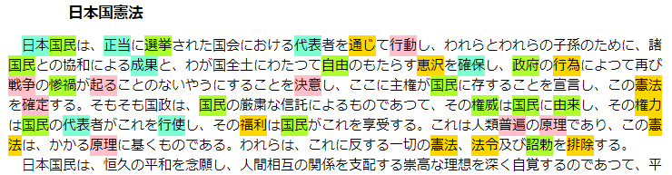

# autoHighlighter

autoHighlighterは自動でキーワード強調表示させるブックマークレットです。

## 特徴

- 自動でキーワードを抽出し、ページ内のキーワードを強調表示します。
- キーワードの自動抽出のためにどこかに文章を送信することはありません。
- キーワードの色(default_colors)や数(num_highlight_words)をパラメーターで設定できます。
- TinySegmenterを使用しているので日本語のページの強調表示に向いています。
- 頻出語句が強調表示され、読書の生産性を上げる効果が期待できます。
- 退屈な文章に出会ったことはありませんか？自動着色が退屈な読書を刺激的にします。

## 自動着色のサンプル画像

## 動作環境

- Google Chrome
- Firefox

## ブックマークレットの作成方法

1. ブラウザからブックマークを追加します。
2. 名前を適当に付けます。
3. URLに[autoHighlighter.js](https://raw.githubusercontent.com/querykuma/autoHighlighter/master/autoHighlighter.js)の中身を貼り付けます。

## ブックマークレットの使用方法

ブックマークレットを左クリックすることで起動します。

選択範囲を指定してからブックマークレットを起動すると選択範囲に対してキーワード強調表示を行います。
選択範囲を指定しない場合、ページ全体に対してキーワード強調表示を行います。

キーワード強調表示状態で再びブックマークレットを起動するとキーワード強調表示を解除します。

## 動作の仕組み

1. TinySegmenterで文章を分かち書きします。
2. 分かち書きされた単語を集計して数の多い順に30個をキーワードとします。
3. 文章をキーワードで強調表示します。

## License

This software is released under the MIT License.
